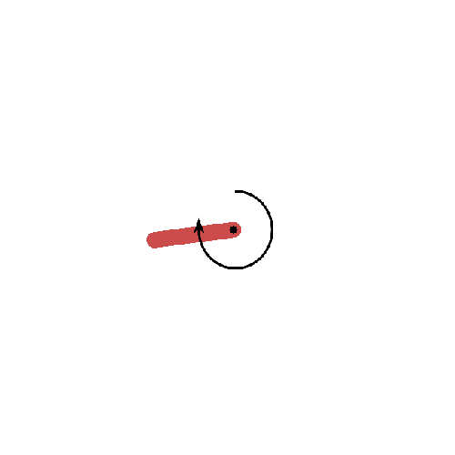
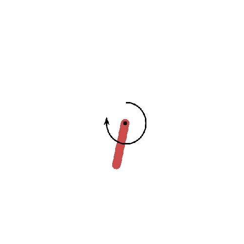

# DDPG_PyTorch
DDPG implementation in PyTorch.

## Paper
Continuous control with deep reinforcement learning ([DDPG](https://arxiv.org/abs/1509.02971))

## Milestone
1. [x] learn from **not** pixel inputs.
2. [x] learn from raw pixel inputs.

## Result
**not pixel inputs**

train about 300 epochs.

**pixel inputs**

train about 1000 epochs.

